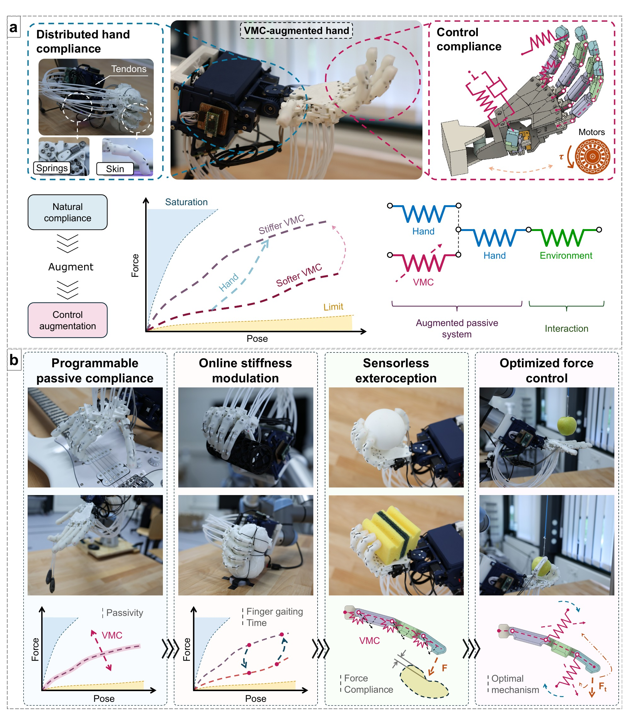
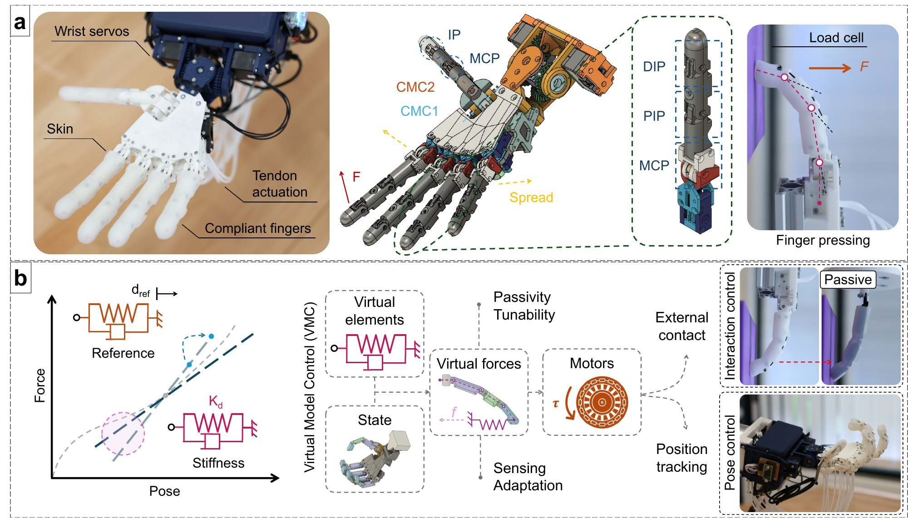

# HumanManipulationVMC

*Virtual Model Control (VMC) for programmable passivity and stiffness modulation
in tendon-driven compliant robotic hands.*

<p align="center">
  
</p>

<sub>**Figure 1.** The hand's natural mechanical compliance is augmented in software with virtual springs and dampers (VMC), giving programmable, passivity-preserving control over its force response.</sub>

## What it does

VMC replaces stiff position control with virtual springs and dampers, computed
from joint/task state and mapped to motor torque. Because the underlying
system stays physically passive, this gives:

- **Programmable passive compliance** — arbitrary, repeatable force-displacement profiles at the fingertip and palm, set purely in software
- **Online stiffness modulation** — smooth transitions across the full soft-to-rigid spectrum, triggered by contact events or task phase
- **Sensorless exteroception** — contact force and object stiffness estimated from virtual-spring deformation, no force sensors needed
- **Optimized force control** — closed-loop tracking over the full force-displacement space via gradient descent on the stiffness model

<p align="center">
  
</p>

<sub>**Figure 2.** The ADAPT Hand (tendon-driven, compliant joints) and the VMC framework: virtual forces are computed from state and mapped to motor torque, driving both interaction control and pose control.</sub>

## Platforms

| | |
|---|---|
| **Single finger** | Tendon-driven finger with MCP and PIP joints, mimic DIP |
| **ADAPT Hand** | Anthropomorphic hand — wrist, thumb, four fingers, spread |

---

## Repository contents

**Experiments** — one self-contained folder per study; `Finger/`/`Hand/` subfolders split by platform where both were used.

| Folder | Study |
|---|---|
| `PassiveCompliance/` | Passive stiffness shaping from virtual springs alone — finger sweeps and hand tasks (guitar playing, weight holding) |
| `TunableCompliance/` | Real-time stiffness modulation across the soft-to-rigid spectrum — contact-triggered shaping, in-hand manipulation, dynamic grasping |
| `ProprioceptiveSensing/` | Sensorless contact-force and object-stiffness estimation from virtual-spring deformation |
| `StiffnessForceTracking/` | Closed-loop force/stiffness tracking via gradient descent on the stiffness model |
| `PoseControl/` | Joint-space pose tracking through grasp-synergy targets |
| `ADAPT-StiffControl/` | End-to-end demo: closed-loop force adaptation on the full hand |
| `MethodsElastic/` | Experimental validation of the VMC stiffness-composition theorem against physical reference springs |
| `Supplementary/` | Additional finger characterisation — nonlinear stiffness laws, contact softening, sensing configurations |

**Core framework**

| Folder | Contents |
|---|---|
| `KinematicsFinger/`, `KinematicsHand/` | Forward kinematics, Jacobians, Hessians |
| `VMCFinger/`, `VMCHand/` | Virtual Model Controllers (ROS2 nodes) |
| `VMC_utils/` | Virtual spring/damper primitives, gravity compensation |
| `StiffnessModelFinger/`, `StiffnessModelHand/` | Stiffness mapping from joint/task space to fingertip stiffness |
| `ModelIDFinger/`, `ModelIDHand/` | Physical parameters — single source of truth |
| `LoadCell/` | Arduino force-sensor interface |
| `UR5_codes/` | UR5 arm control (RTDE) |
| `FusionPlotting/` | Fusion 360 add-in to drive CAD joints from Python |

---

## Getting started

Bring the hardware to a safe home position before any experiment:

```bash
./start_finger.sh   # home + latency timer + dynamixel node (finger)
./start_hand.sh     # home + latency timer + dynamixel node (hand)
```

Then, from the repository root:

```bash
python3 PassiveCompliance/Finger/passive_stiffness_sweep.py
python3 ADAPT-StiffControl/grasp_adaptation.py
```

**Requirements**: ROS2 Humble with the `dynamixel_interface` package — download with `git clone git@github.com:CREATE-Lab-EPFL/ros2_dynamixel.git` — plus:

```bash
pip install numpy scipy sympy pandas matplotlib scienceplots \
            scikit-learn tqdm pynput rtde-control rtde-receive \
            pyserial noisereduce soundfile
```

## Documentation

- [VMCHand/HAND_VMC_DOCUMENTATION.md](VMCHand/HAND_VMC_DOCUMENTATION.md) — hand controller API, motor ordering
- [VMCFinger/FINGER_VMC_DOCUMENTATION.md](VMCFinger/FINGER_VMC_DOCUMENTATION.md) — finger controller API
- [KinematicsHand/KINEMATICS_DOCUMENTATION.md](KinematicsHand/KINEMATICS_DOCUMENTATION.md) — hand FK/Jacobian reference
- [KinematicsFinger/KINEMATICS_DOCUMENTATION.md](KinematicsFinger/KINEMATICS_DOCUMENTATION.md) — finger FK/Jacobian reference

## License

MIT — see [LICENSE](LICENSE).
